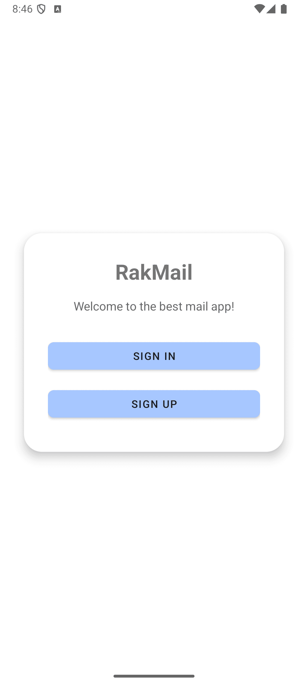
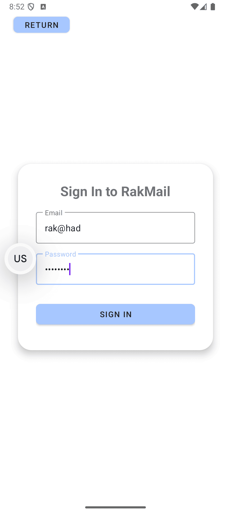
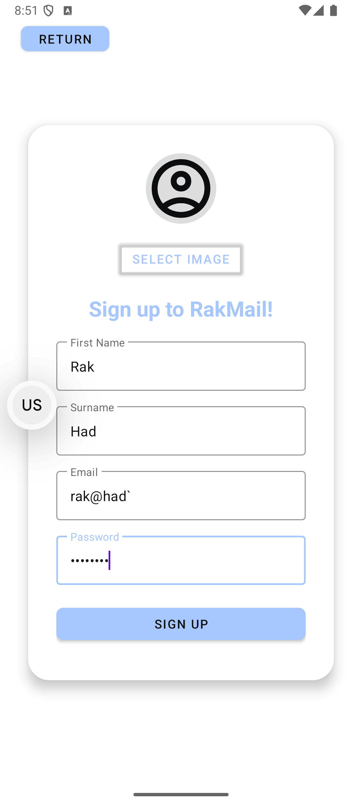
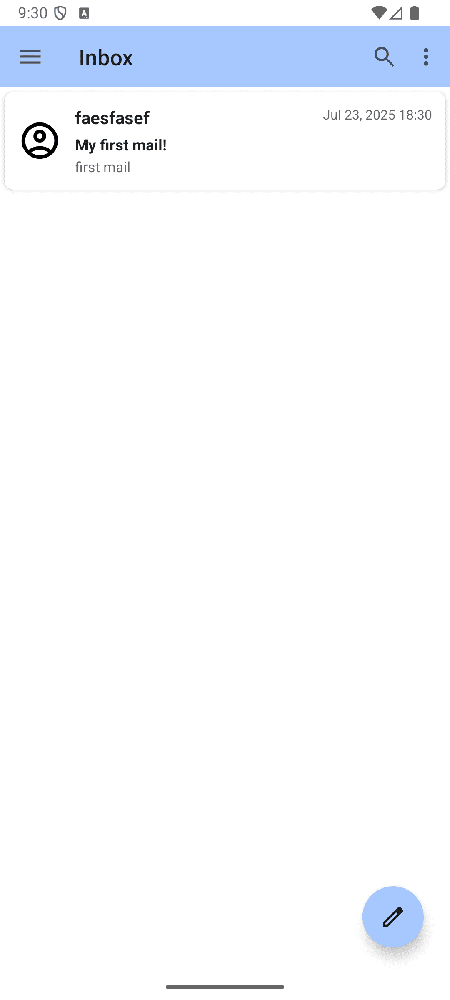
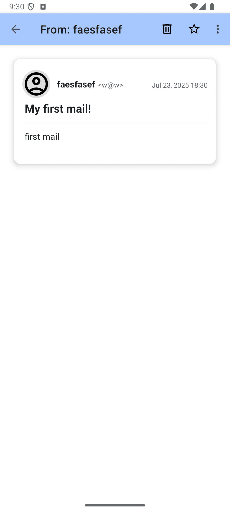
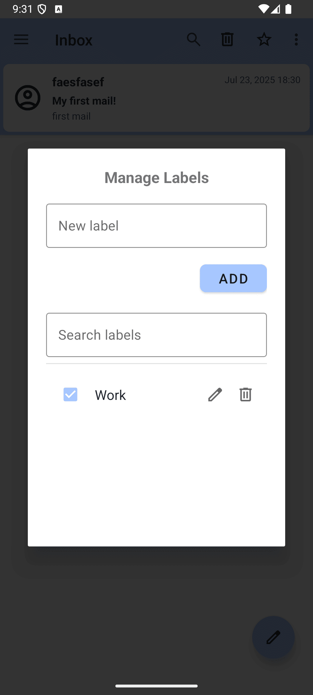

# Android Client – Mail App

This is the Android client for the APProject mail system, providing a native interface to send, receive, and manage emails.

## Features
- Login & JWT authentication
- View inbox, starred, drafts, spam
- Compose & send mails
- Create & manage labels
- Dark/Light theme support
- Responsive UI with Material Design

## How to Run
1. Install Android Studio
2. Clone the project
3. Open `src/AndroidApp` in Android Studio & sync Gradle
4. Run on emulator or device
5. Ensure backend & blacklist server are running (see [Full Stack Mail App](../FullStack_Mail_App/Overview.md))

## Project Structure
com.rakmail.androidapp/ 
├ ── core/ 
│   ├── api/         # Network client & API logic 
│   ├── auth/        # Authentication logic & interceptors 
│   ├── prefs/       # Shared preferences (auth, user) 
│   └── util/        # Utilities and helpers 
├ ── features/ 
│   ├── compose/     # Compose mail screen 
│   ├── inbox/       # Inbox screen 
│   ├── label/       # Label management 
│   ├── launcher.ui/ # Launcher screen & navigation 
│   ├── mail/        # General mail logic 
│   ├── maildetail/  # Mail detail screen 
│   ├── search/      # Search functionality 
│   ├── settings/    # Settings screen 
│   └── user/        # User profile & view models 
└ ── App              # Application class 

### 🔗 Technologies
- Android (Kotlin/Java)
- MVVM pattern
- Retrofit / OkHttp (likely, via `api`)
- SharedPreferences

## Demos

### Screenshots
Below are some screenshots showcasing the features of the Android Mail App:

1. **Launcher Screen**:
   

2. **Sign In**:
   

3. **Sign Up**:
   

4. **Inbox**:
   

5. **Mail Details**:
   

6. **Compose Mail**:
   

7. **Manage Labels**:
   

8. **Label Filter**:
   

9. **Search Functionality**:
   

10. **Settings Panel**:
    

11. **Dark Mode**:
    

12. **Sidebar Navigation**:
    

13. **Action Bar Menu**:
    