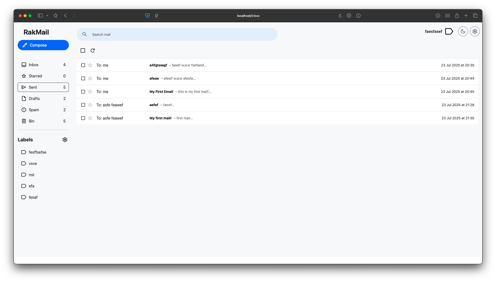
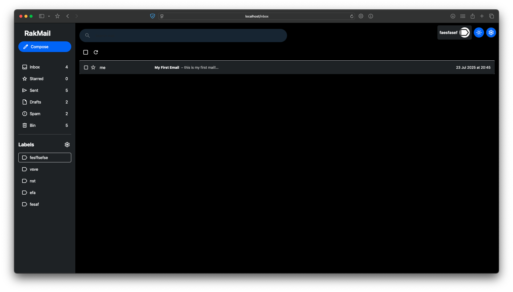
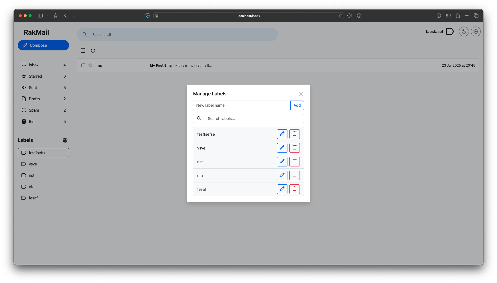
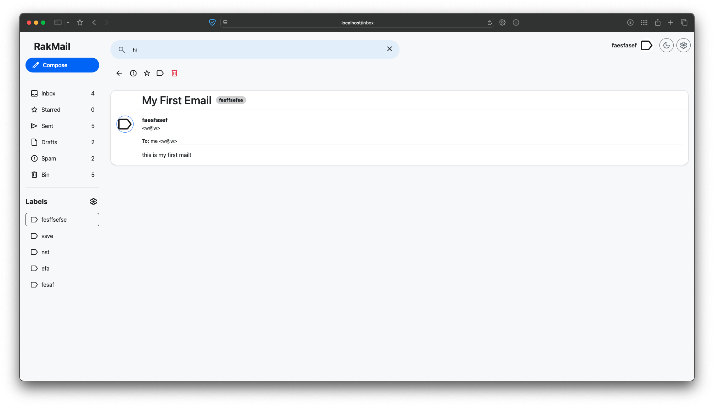
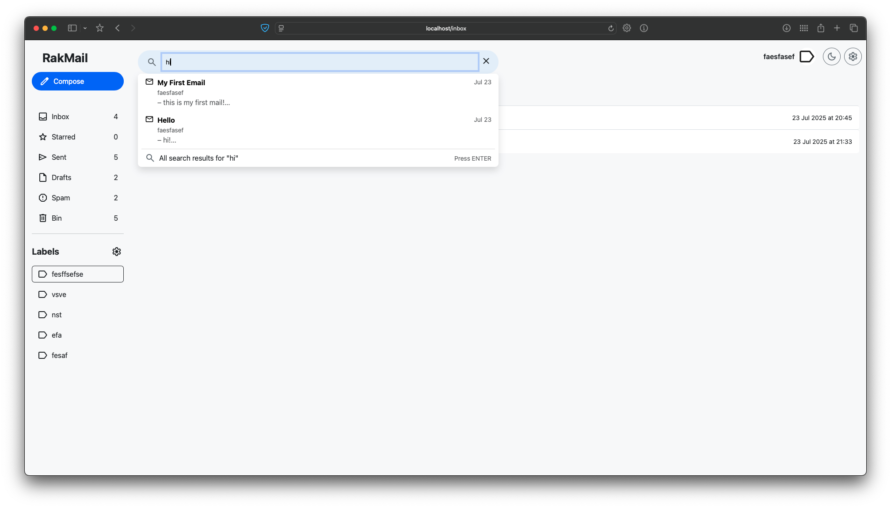
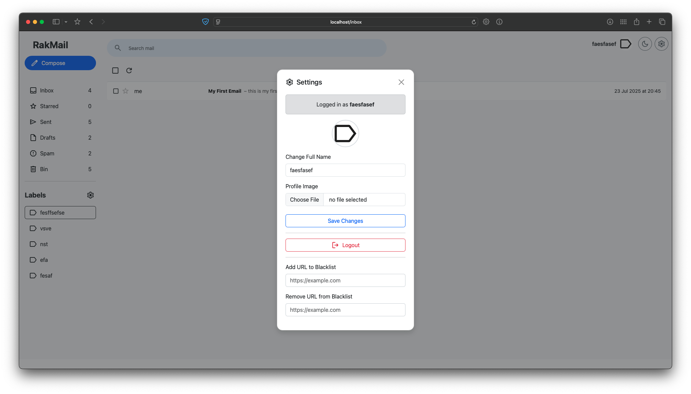
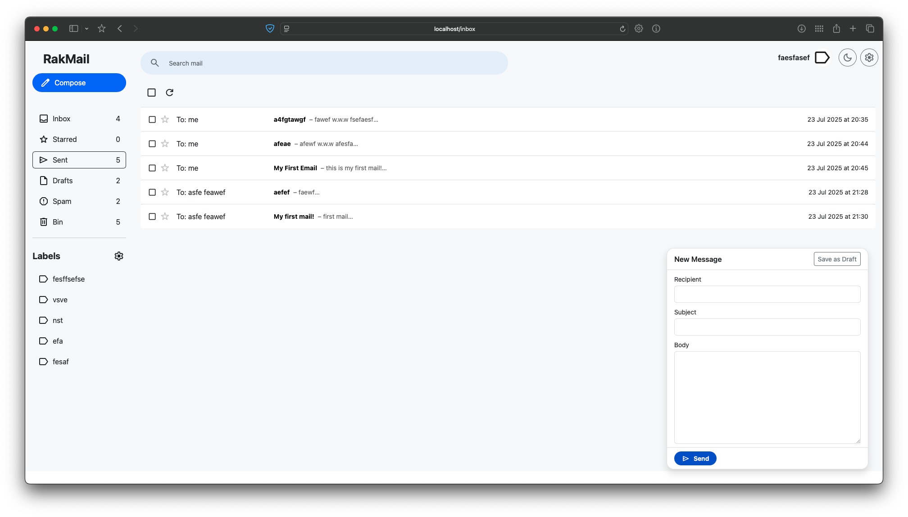

# APProject – Full Stack Mail WebApp

This is a full-stack Gmail-style web application designed for sending, receiving, and managing mails, with support for custom labels, spam filtering, theming (including dark mode), and a TCP-based blacklist integration.

## Components
- Backend: REST API (Express + Mongo + TCP Blacklist)
- Frontend: React SPA with hooks, context, themes
- Blacklist Server: TCP server with Bloom Filter

## Requirements
- Docker & Docker Compose (recommended)
- Node.js (if running backend manually)
- npm (for frontend development mode)
- MongoDB (optional, falls back to in-memory if not configured)
- `.env.production` file in the `config/` folder with:
```
PORT=8000
JWT_SECRET=your_jwt_secret_key
TOKEN_EXPIRY=3600
MONGO_URI=mongodb://localhost:27017/rakmail
```

## How to Run
With Docker (recommended):
docker compose up --build webserver

Runs:
- webserver → frontend + backend on port 80
- blacklist_server → TCP server on port 4545
- mongo_db → MongoDB on port 27017

## Highlights
- Beautiful UI with light/dark theme
- Full CRUD for mails and labels
- Search, context menus
- Fully Dockerized deployment

## Demos

### Screenshots
Below are some screenshots showcasing the features of the FullStack Mail App:

1. **Home Page**:
   

2. **Dark Mode**:
   

3. **Label Manager**:
   

4. **Mail Details**:
   

5. **Search Functionality**:
   

6. **Settings Page**:
   

7. **Docker Compose Setup**:
   